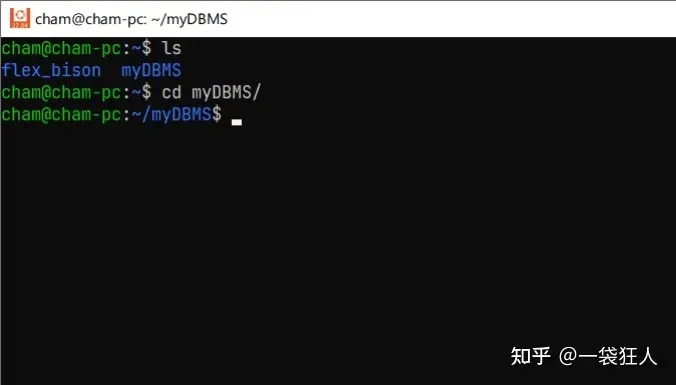

> 为了写大作业，装了个WSL Ubuntu22.04 LTS，它作为Windows App默认被安装到了C盘。然而我的C盘只剩20GB空间，随便装点就要爆满了。于是我想把它迁移到D盘去。


# 1. 准备工作
打开CMD，输入`wsl -l -v`查看wsl虚拟机的名称与状态。

wsl虚拟机的名称与状态
了解到本机的WSL全称为Ubuntu-22.04，以下的操作都将围绕这个来进行。
输入 wsl --shutdown 使其停止运行，再次使用wsl -l -v确保其处于stopped状态。
# 2. 导出/恢复备份
在D盘创建一个目录用来存放新的WSL，比如我创建了一个 D:\Ubuntu_WSL 。
①导出它的备份（比如命名为Ubuntu.tar)
```
wsl --export Ubuntu-22.04 D:\Ubuntu_WSL\Ubuntu.tar
```
②确定在此目录下可以看见备份Ubuntu.tar文件之后，注销原有的wsl
```
wsl --unregister Ubuntu-22.04
```
③将备份文件恢复到D:\Ubuntu_WSL中去
```
wsl --import Ubuntu-22.04 D:\Ubuntu_WSL D:\Ubuntu_WSL\Ubuntu.tar
```
这时候启动WSL，发现好像已经恢复正常了，但是用户变成了root，之前使用过的文件也看不见了。
# 3.恢复默认用户
在CMD中，输入 Linux发行版名称 config --default-user 原本用户名
例如：
```
Ubuntu2204 config --default-user cham
```
请注意，这里的发行版名称的版本号是纯数字，比如Ubuntu-22.04就是Ubuntu2204。
这时候再次打开WSL，你会发现一切都恢复正常了。



大功告成